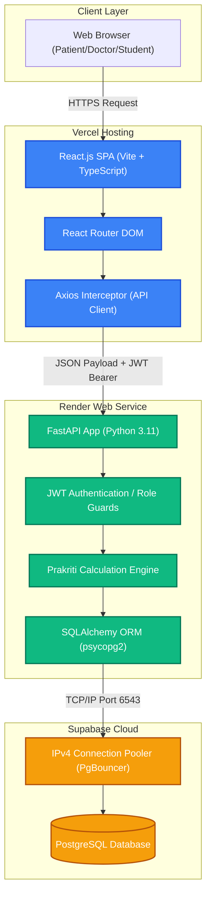
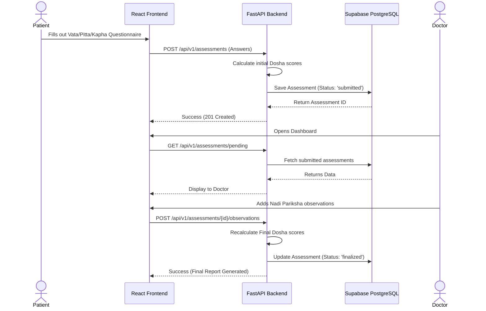
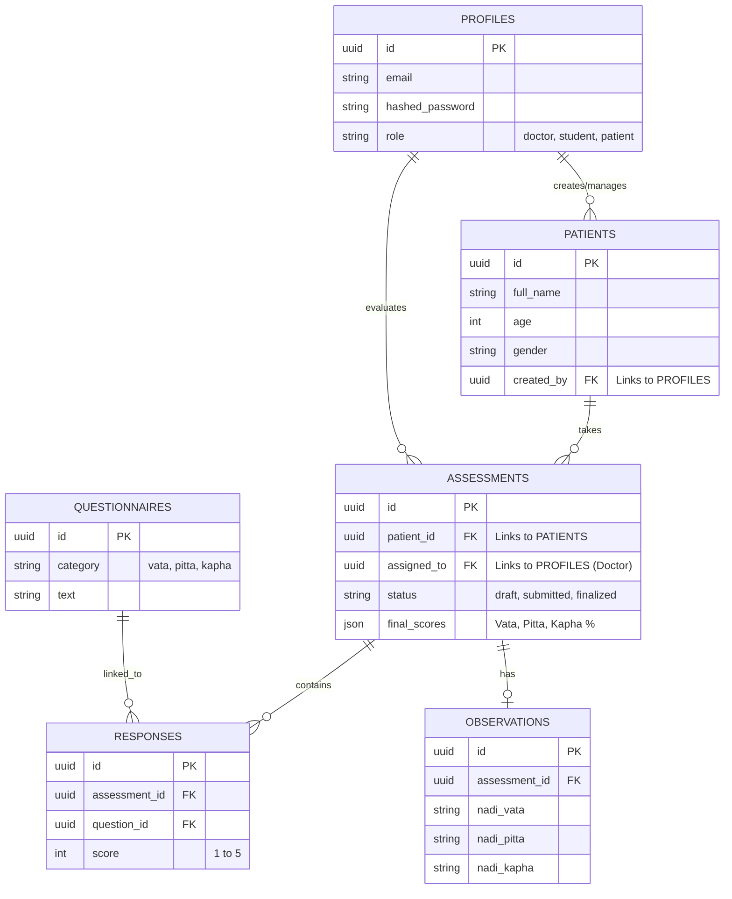

# AyurEssence System Architecture

Below is the complete architectural content for your project. You can use these text summaries, technical stack details, and the Mermaid.js code blocks directly in your presentations, README files, or project reports.

---

## 1. High-Level System Architecture Diagram

This diagram shows how the frontend, backend, and database communicate with each other. 

*(If you are putting this in GitHub or a Markdown file, copy the code block below exactly as is, and it will automatically render as a diagram).*

---

## 2. Technology Stack Overview

**Frontend (Client Side):**
* **Core:** React 18, TypeScript, Vite
* **Routing:** React Router v6
* **Styling:** Tailwind CSS, Framer Motion (for smooth micro-animations), Lucide React (Icons)
* **Network Communication:** Axios (configured with JWT interceptors for auto-attaching auth headers)
* **Hosting:** Vercel

**Backend (Server Side):**
* **Core:** FastAPI (Python 3.11)
* **Server:** Uvicorn (ASGI web server)
* **Database ORM:** SQLAlchemy 2.0 (using `psycopg2` driver)
* **Security:** JWT (JSON Web Tokens) for stateless authentication, Passlib/Bcrypt for password hashing
* **Hosting:** Render Web Services

**Database (Data Layer):**
* **Primary Database:** PostgreSQL (Hosted on Supabase)
* **Connection Routing:** Supabase IPv4 Transaction Pooler (PgBouncer)
* **Fallback Database:** Local SQLite (Automatic failover during network outages)

---

## 3. Data Flow Architecture: Prakriti Assessment

This diagram explains the specific logic flow when a patient takes an assessment and a doctor verifies it.

---

## 4. Database Schema (ERD) Overview

Here is a conceptual view of how the database tables are linked together:

### Explanation of the Architecture:
1. **Separation of Concerns:** The application uses a strict separation between the frontend (presentation layer) and the backend (business logic). This means you could theoretically build an iOS or Android app tomorrow that uses the exact same backend API without changing any Python code.
2. **Stateless Authentication:** Using JWT means the backend does not need to store active session IDs in memory. When a request comes in, the backend just verifies the cryptographical signature of the token to know who the user is.
3. **Database Fallback Protocol:** The backend is built with high availability in mind. If the external Supabase server ever goes offline or blocks connections, the FastAPI server automatically traps the error and spins up a local SQLite database file, preventing the app from crashing.
